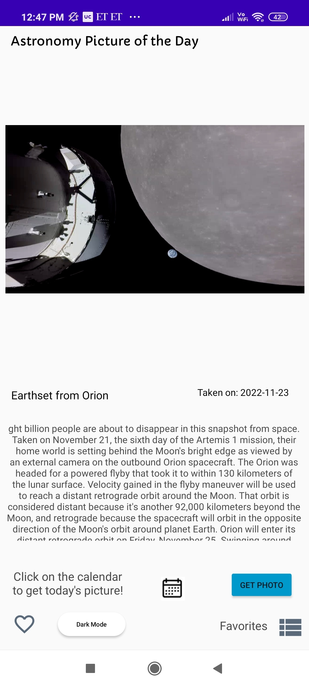
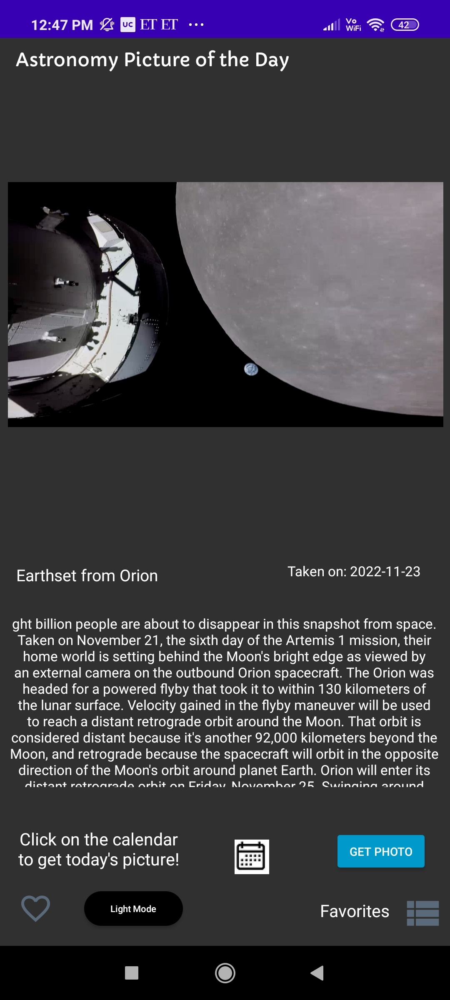
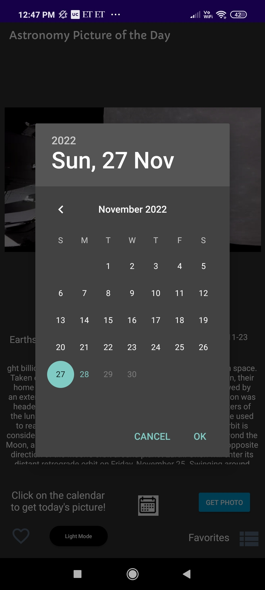
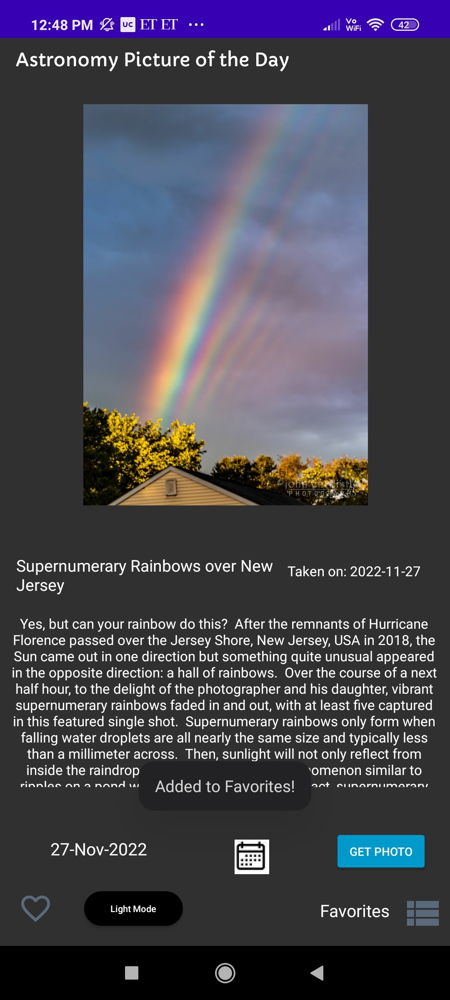
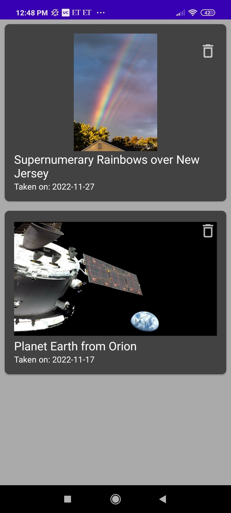

Libraries Included

    LeakCanary (UI based Library for detecting memory leaks)
    Glide (A powerful image downloading and caching library for Android.)
    Volley (An HTTP library that makes networking for Android apps easier.)

Features

    Allow users to search for the picture for a date of their choice.
    Allow users to create/manage a list of "favorite" listings.
    Displays date, explanation, title and the image of the day.

Enhancements

    Dark mode support
    Handling for different screen sizes and orientations.

## Screenshots ##
#### *First screen on the app* ####

#### *Switch the app to dark mode* ####

#### *Open the calendar to select a date* ####

#### *"Add" it to "Favorites" and save the list.* ####

#### *Favorites List Page* ####

